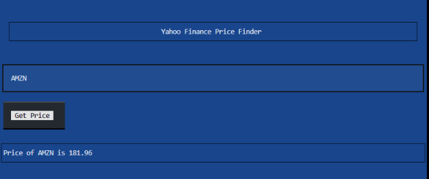

# Stock Monitor

Beginning steps for a stock monitor app: using yfinance and Textual
to fetch and display stock prices with a friendly UI, all from the terminal.

## Installation

Use the package manager [pip](https://pip.pypa.io/en/stable/) to install textual.

```bash
pip install textual
```

## Usage

```bash
python stockmonitor,py
```



Enter the stock symbol you want to find, and press the button to display its current ticker price.

## Contributing

Pull requests are welcome. For major changes, please open an issue first
to discuss what you would like to change.

Please make sure to update tests as appropriate.